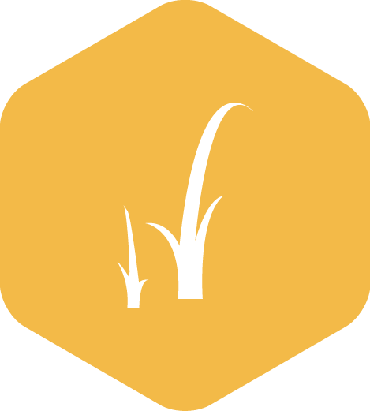
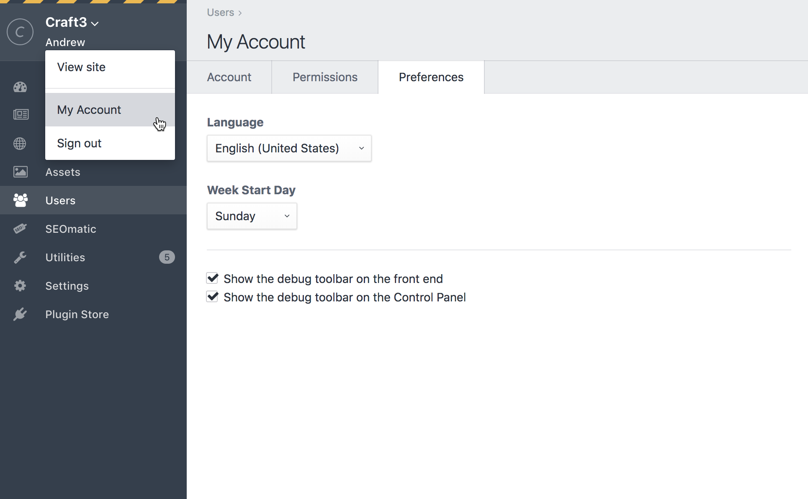
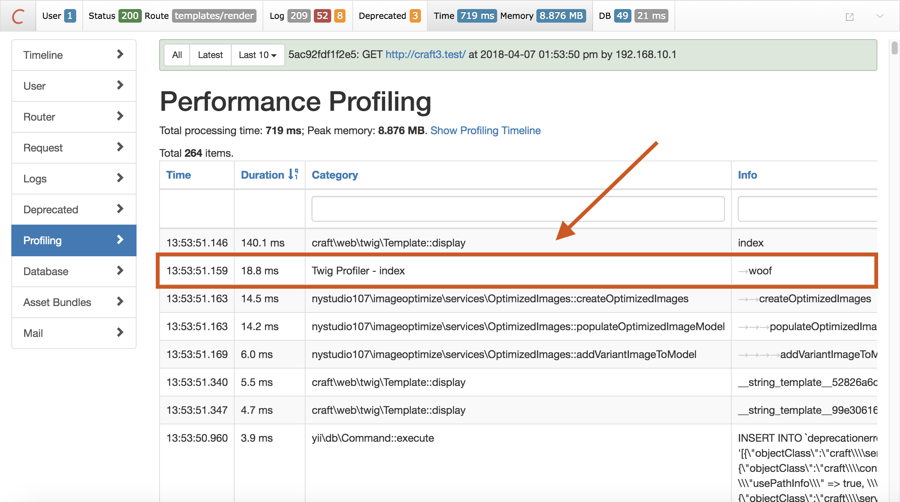
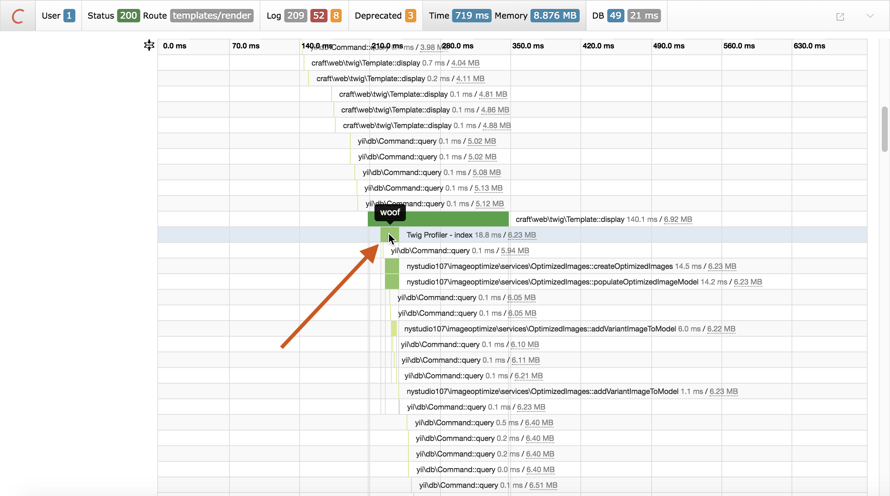

[](https://scrutinizer-ci.com/g/nystudio107/craft-twigprofiler/?branch=v1) [](https://scrutinizer-ci.com/g/nystudio107/craft-twigprofiler/?branch=v1) [](https://scrutinizer-ci.com/g/nystudio107/craft-twigprofiler/build-status/v1) [](https://scrutinizer-ci.com/code-intelligence)

# Twig Profiler plugin for Craft CMS 3.x

Twig Profiler allows you to profile sections of your Twig templates, and see the resulting timings in the Yii2 Debug Toolbar



## Requirements

This plugin requires Craft CMS 3.0.0 or later.

## Installation

To install the plugin, follow these instructions.

1. Open your terminal and go to your Craft project:

        cd /path/to/project

2. Then tell Composer to load the plugin:

        composer require nystudio107/craft-twigprofiler

3. In the Control Panel, go to Settings → Plugins and click the “Install” button for Twig Profiler.

Or you can install the plugin via the **Plugin Store** in the Craft CMS 3 AdminCP.

## Twig Profiler Overview

Twig Profiler lets you record profiling information on chunks of your Twig template code, so you can see how long it takes to execute.

## Configuring Twig Profiler

To use Twig Profiler, you'll need to enable the [Yii2 Debug Toolbar](https://yii2-framework.readthedocs.io/en/stable/guide/tool-debugger/), since it's what is used to display the profile information.



To enable it, go to the your Account page, and click on the **Preferences** tab. Then check the **Show the debug toolbar on the front end** and/or **Show the debug toolbar on the Control Panel** checkboxes, depending on where you want the toolbar to appear.

You'll then have the Debug Toolbar appearing at the bottom of your pages:


If you want to learn more about the Debug Toolbar, check out the [Profiling your Website with Craft CMS 3’s Debug Toolbar](https://nystudio107.com/blog/profiling-your-website-with-craft-cms-3s-debug-toolbar) article.

## Using Twig Profiler

### Quick Overview

To use Twig Profiler, just wrap any chunks of Twig code you like in:

```twig

    {# code goes here #}

```
The parameter you pass in (`woof` in the above example) should be unique per profile block, so you can identity it when looking at the profiling data.

Reload your page, and then click on the **Time** section of the Debug Toolbar, and you'll see your profile data:



The **Duration** column shows how long it took to execute the chunk of code inside of the `` block.

The **Category** column shows the type of the profile sample, which will always been **Twig Profiler** along with the name of the template, for profile data collected by Twig Profiler.

The **Info** column shows the unique identifier we passed in.

You can filter the display to show only the **Category** or **Info** you want by typing into the text boxes above the columns.

Clicking on the **Timeline** section on the left will show you a visual timeline of the profile data:



Hovering over the green sections will show you the **Info** identifier you passed in.

### Pro Tips

You can have as many `` block tags a page as you like, and they can wrap around any Twig code you like (`include`, `block`, whatever).

You can nest `` block tags as much as you like.

Profile data is only collected when `devMode` is on. If you turn `devMode` off, the `` block tags do nothing, so you can safely leave them in your production code.

Under the hood, it uses the exact same method that Craft/Yii2 use to record profiling data.

## Twig Profiler Roadmap

Some things to do, and ideas for potential features:

* Release it

Brought to you by [nystudio107](https://nystudio107.com/)
